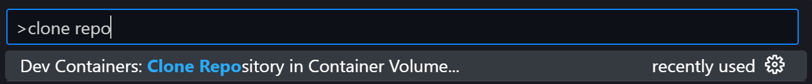

# MobiFlight website

Website for MobiFlight, written in [Hugo](https://gohugo.io/) with the [hugo-arcana theme](https://github.com/half-duplex/hugo-arcana). This documentation is deployed using CloudFlare Pages to the [MobiFlight site](https://www.mobiflight.com/). See the [deployment guide](DEPLOYMENT.md) for information on how to deploy.

## Editing the documentation

The documentation is set up for editing using Visual Studio Code dev containers:

1. [Install VSCode](https://code.visualstudio.com/)
2. [Install Docker Desktop](https://docs.docker.com/get-started/introduction/get-docker-desktop/)
3. Install the [Dev Containers](https://marketplace.visualstudio.com/items?itemName=ms-vscode-remote.remote-containers) extension
4. Run VSCode
5. Hit `CTRL-SHIFT-P` and type `clone repo` to find the dev container command and select it: 

6. Enter this repo's URL (https://github.com/neilenns-projects/mobiflight-website)
7. Wait for the dev container to build

To view the documentation press `F5` and it will automatically build and open in Edge. To use Chrome instead select `Launch Chrome` in the run and debug tab.
